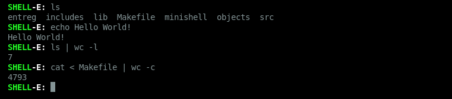
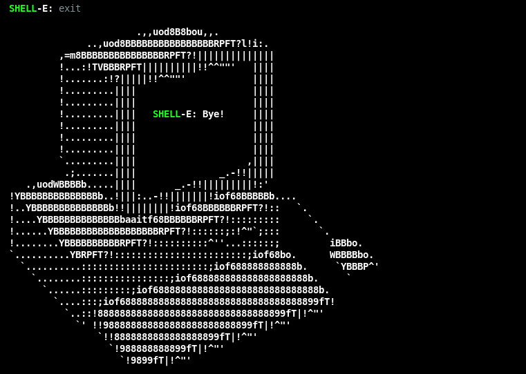

````markdown
# minishell

Implementação de um shell minimalista em C, desenvolvido como parte do currículo da 42.

Este projeto simula o comportamento básico de um terminal Unix, com suporte a execução de comandos, pipes, redirecionamentos, variáveis de ambiente e sinais.

---

## 🧩 Funcionalidades

- Execução de comandos externos com argumentos
- Comandos encadeados com pipes (`|`)
- Redirecionamentos de entrada e saída (`>`, `>>`, `<`)
- Expansão de variáveis (`$VAR`)
- Execução de comandos entre aspas simples e duplas
- Sinais: `Ctrl+C`, `Ctrl+\`, `Ctrl+D`
- Built-ins:
  - `cd`
  - `echo`
  - `env`
  - `exit`
  - `export`
  - `pwd`
  - `unset`

---

## 🛠️ Como compilar e executar

```bash
git clone https://github.com/seu-usuario/minishell.git
cd minishell
make
./minishell
```

> É necessário ter a biblioteca `readline` instalada.

---

## 📸 Exemplos de uso

### Execução de comandos



### Encerrando com `exit`



---

## ⚠️ Observações

* O comportamento busca se aproximar do bash, respeitando as restrições do projeto.
* A parser foi escrito do zero, sem uso de `system()`.
* O shell lida com múltiplas execuções simultâneas, controlando processos filhos e sinalizações corretamente.

---

## 👨‍💻 Autor

**Lucas Andrey**
Estudante da 42 | Análise e Desenvolvimento de Sistemas
https://www.linkedin.com/in/lucas-andrey7/
---

## 📄 Licença

Este projeto é de uso educacional. Sinta-se livre para estudar e modificar conforme necessário.

````
